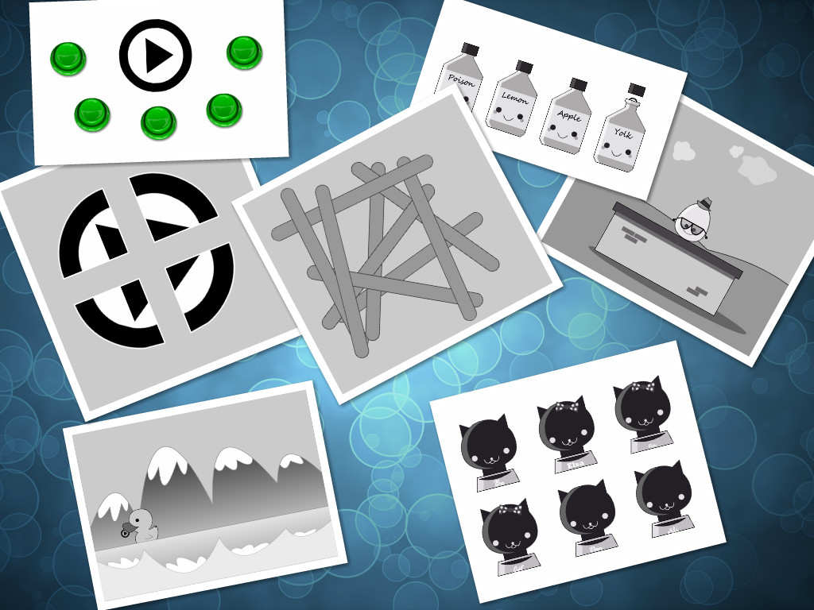

时间过得好快，转眼就快毕业三年了，已经待了两家公司，写代码的热情也不如从前，不知道是什么原因，反正希望未来更美好。现在总结一下我的编程之路，算送给自己的一个礼物吧。
<!-- more -->

## 2013 年
从我的第一个游戏开始，那时候刚学会了 C 语言，仗着自己对编程的热爱，学了一点点的 actionScript，就开始了游戏之旅，大概花了 23 天的时间完成了这个具有 20 关的**寻找播放按钮的小游戏**

小游戏

## 2014 年
在何腾欢的代领下开始接触到 nodejs 和html/css/js，那时候 QQ 盛行，我们两个共同做了一个聊天网站，本来想要发布，后来也就那样。
* [blop](https://github.com/double2kill/blop) 一个专属BIT的聊天室

blop

## 2015 年
读研了研究生，被调剂到了航空专业，选了一个**可以编程**的导师，算是误入歧途吧。深刻体会了一次研究生的生活，装双系统，开始接触ubuntu，接触vim等等。

* 闲暇之余也为实验室的同学开发了一个 [**保皇**](https://github.com/double2kill/BaoHuang) 的扑克牌游戏。
* 游戏选修课大作业开发了一个游戏 —— [**小兵必须死**](https://github.com/double2kill/SoldierMustDead)

保皇

小兵必须死

## 2016 年
进入了航空航天专业，虽然家人和导师都要求着要继续从事本专业，但是依然对编程有很高的热情，为了找工作，开始看起了视频，学习前端，跟着scott 开始学习 nodejs和前端，成功搭建起一个像样的服务，也因此为实验室开发了一个完整功能的报账系统，包含增删改查和登录等功能。

* 接触到vue库, 并用vue库搭建了一个[markdown编辑器](https://github.com/double2kill/resume)，并借此去当做实习简历，虽然最后失败了。
* 去参加飞鱼科技的宣讲会，宣讲会上玩了一步两步游戏，后来自己也做了一个网页版的[一步两步](https://github.com/double2kill/tengxun/tree/master/public/yibuliangbu)

markdown编辑器

一步两步

## 2017 年
毕业季，疯狂的刷前端的基础知识，找到网龙的工作以后就专心准备毕业，毕业之后就进入网龙开始了正式的前端之旅。学习原生 js 开发管理台，学习 react 开发管理后台，进入大厂跟着在 12 月份加班守护项目，第一次分工如此明确，很开心能在这个阶段完成对开发的认识。

## 2018 年
从守护项目加班的状态结束后回到正常的状态，对管理台的功能有更深入的接触，接触到导入导出功能，第一次对自己的功能进行封装复用，也对异步有了更深入的认识。7 月份就从福州转战至厦门，在厦门开始接触到 h5 的概念，接触到移动 web 以及与移动端对接，也看到了厦门的人情世故，站在更高一个层次看待程序员这个职业，遇到了一些很好的领导。

## 2019 年
由于项目和公司的变迁，开始进入了海外团队，被厦门最资深的领导带着，学到了很多有用的知识，从零开始思考整个构建，技术选型，代码的开发，用上最新的 react技术，使用英语与美国的 PM 沟通，也看到了超级厉害的同事，也为此项目加了不少班，慢慢感觉自己已经不适合在这家公司待下去。一直到了9 月份，开始刷题，准备面试，很高兴能够只面试一家就进入 Ringcentral，一个 955 的公司。告别了网龙，也希望网龙越来越好。

## 2020 年
一转眼就 6 个月转正了，但其实从感觉上来说，只有经历过两个 release，第一个 release 懵懵懂懂做着事情，熟悉公司的流程。第二个 release 感觉就对公司流程有了更多的认识，能够开始有自己的思考，主动的发现任务，然后去解决完成。两个 release 让我慢慢的意识到自动化的作用，对产品质量也有了不一样的认识，Ringcentral 确实是一个教科书的公司，从人事，PM，制度，jira 流程来说，绝对是数一数二的。不加班有时间装修装修自己的 github，开始学到了 vue，认真的为自己制作了一个高质量的网站，不糊弄不含糊，搭建自动化部署。

